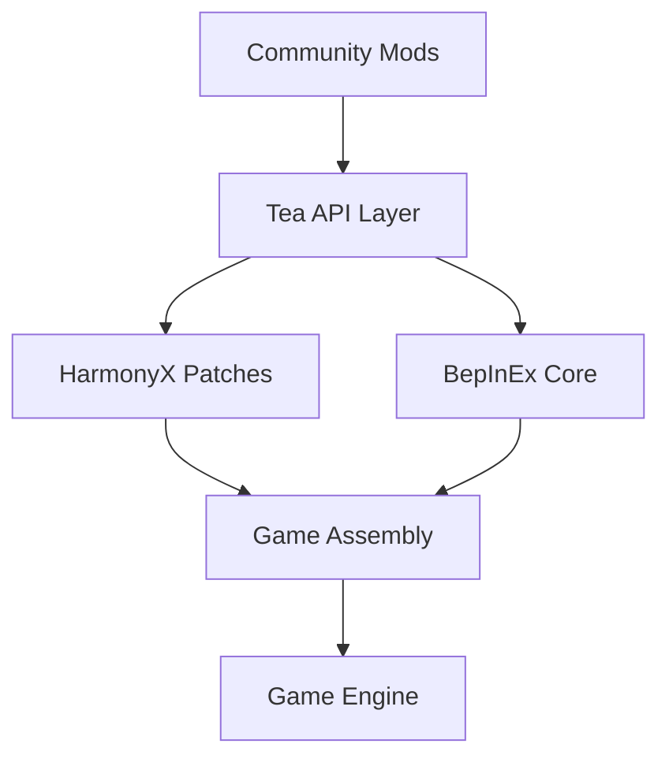

<div align="center">

# Tea Mod API | 茶模组API 
[](https://github.com/yourname/tea-mod-api/milestones)
[](https://docs.bepinex.dev/)
[](LICENSE)

**一杯茶的功夫即可上手的游戏模组开发框架**​ | *A sip of tea to start surful modding!*  
**目前只是画饼阶段😛**​ | *Currently, it's just a pie in the sky.*  

</div>

## 🌟 Features...I mean futures | 未来核心功能

<table>
<tr>
<th>English</th>
<th>中文</th>
</tr>
<tr>
<td>

- ✨ ​**Zero-Boilerplate**​ Mod initialization  
- 🛠️ ​**HarmonyX Wrapper**​ for painless patching  
- 🎮 ​**Event System**​ catching 20+ game hooks  
- ⚙️ ​**Auto-Generated Config UI**​ with hot-reload  
- 📦 ​**Asset Pipeline**​ (Texture/Audio/Prefab)  
- 📡 ​**Mod Communication Bus**​ with RPC support  
- 📚 ​**Step-by-Step Tutorials**​ & Live Demos

</td>
<td>

- ✨ ​**零模板代码**的模组初始化  
- 🛠️ ​**HarmonyX 封装**实现无痛代码注入  
- 🎮 捕捉**20+游戏事件**的钩子系统  
- ⚙️ ​**配置界面自动生成**且支持热重载  
- 📦 资源加载管线（贴图/音频/预制体）  
- 📡 支持RPC调用的**Mod通信总线**​  
- 📚 渐进式教程 & 实时案例库

</td>
</tr>
</table>

## 🧩 Architecture | 架构设计



## 🚧 Contribution Guidelines | 贡献指引
<!-- 添加具体开发路线图 -->
### 2025.3
```plaintext
[□□□□□□□□□□] 核心框架 (0%)
[□□□□□□□□□□] 文档系统 (0%)
[□□□□□□□□□□] 示例项目 (0%)
</div>
